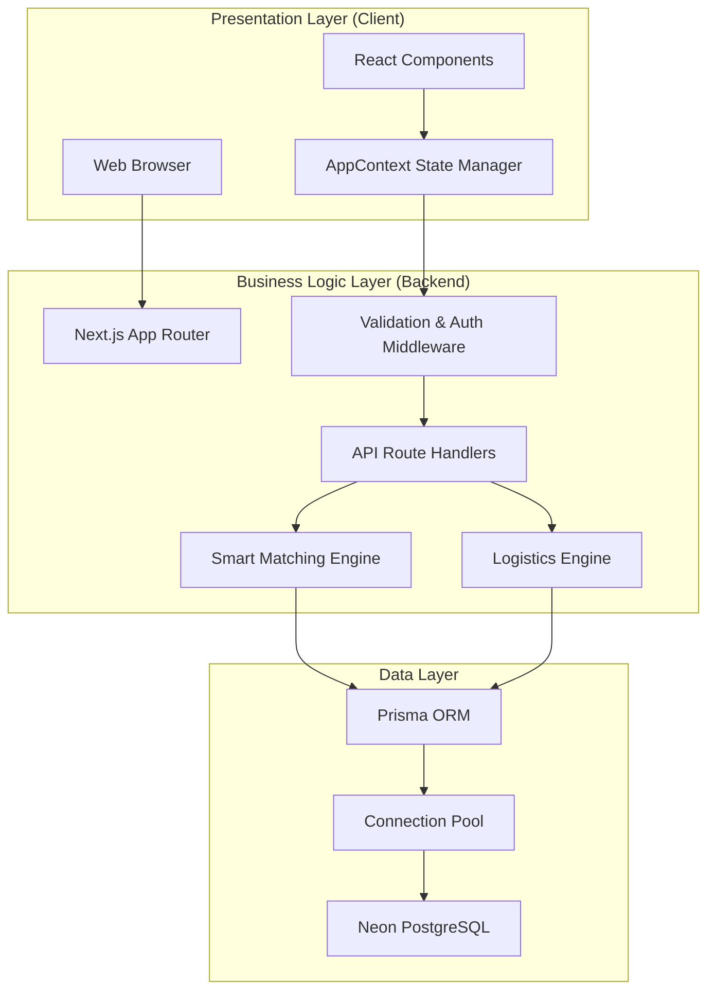
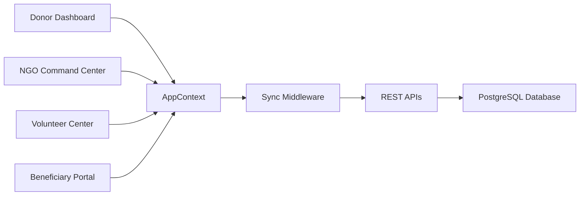

#  FeedLink — Smart Food Surplus & Hunger Management Platform


FeedLink is a **full-stack food surplus management platform** designed to reduce food waste by connecting **food donors, NGOs, volunteers, and beneficiaries** in a smart logistics ecosystem.

The platform enables **real-time food donation tracking, volunteer coordination, QR-based verification, NGO matching, and IoT-powered community fridge monitoring**.

---

##  Live Demo

🔗 **Live Application:**  
https://feedlink-omega.vercel.app

---

##  Problem Statement

Every day, restaurants, caterers, and hotels waste large amounts of food while many communities still struggle with hunger.

FeedLink solves this problem by creating a **smart food redistribution network** where:

- **Donors** can donate surplus food
- **NGOs** can accept nearby donations
- **Volunteers** can manage pickups & deliveries
- **Beneficiaries** can reserve meals

The system optimizes logistics using **distance-based matching** and **food urgency prioritization**.

---

##  Features

###  Donor Dashboard
- Real-time donation creation
- Food quantity & category tracking
- Shelf-life estimation
- Urgency tagging (Fresh / Moderate / Critical)

###  NGO Command Center
- Nearby donation discovery
- Smart matching system
- Capacity management
- One-click donation acceptance

###  Volunteer Logistics
- Pickup & delivery task management
- QR-code verification system
- Chain of custody tracking
- Volunteer leaderboard system

###  Community Fridge Network (IoT Simulation)
- Real-time fridge monitoring
- Fill level tracking
- Temperature monitoring
- Spoilage risk prediction

###  Beneficiary Portal
- Meal reservation system
- Dietary filtering
- Priority-based distribution

###  Sustainability Dashboard
- Carbon footprint reduction tracking
- Meal impact analytics
- CSR reporting support

###  Disaster Relief Module
- Emergency food coordination
- Relief supply tracking
- Camp distribution management

---

##  System Architecture

FeedLink follows a **three-tier architecture** optimized for scalability, real-time updates, and serverless deployment.

### Architecture Overview



---

##  Component Interaction Flow



---

##  Tech Stack

### Frontend
- **Framework:** Next.js (App Router)
- **Library:** React
- **Styling:** CSS
- **Icons:** Lucide React
- **Animations:** Canvas Confetti

### Backend
- **Runtime:** Next.js Serverless Functions
- **API:** REST APIs
- **Authentication:** bcryptjs + JWT

### Database
- **Database:** Neon PostgreSQL
- **ORM:** Prisma ORM

### Utilities
- **Distance Calculation:** Haversine Formula
- **QR Verification:** Unique QR identifiers
- **Diagrams:** Mermaid.js

---

##  Engineering Highlights

### 1. Optimistic UI Updates

Instead of waiting for API responses before updating UI, FeedLink uses an **Optimistic UI pattern**.

This means:

1. UI updates instantly
2. Database sync happens in background
3. Automatic rollback occurs if API fails

This improves perceived performance significantly.

Example approach:

```javascript
dispatchWithSync(action) {
  setAppState(reducer(currentState, action));

  fetch('/api/donations/' + action.id, {
    method: 'PATCH',
    body: JSON.stringify(action.payload)
  })
  .catch(() => {
    setAppState(reducer(appState, { type: 'UNDO' }));
  });
}
```

---

### 2. Smart Matching Logic

FeedLink uses the **Haversine Formula** to calculate distance between donors and NGOs.

Matching is based on:

- Distance
- NGO capacity
- Food urgency
- Storage capability

This ensures efficient food redistribution.

---

### 3. Serverless Database Optimization

To avoid database connection exhaustion on Vercel:

- Prisma Client Singleton Pattern is used
- Neon Serverless Driver is integrated
- Connection pooling is enabled

Example:

```javascript
const globalForPrisma = global || {};

export const prisma =
  globalForPrisma.prisma ||
  new PrismaClient();

if (process.env.NODE_ENV !== "production") {
  globalForPrisma.prisma = prisma;
}
```

---

##  Database Schema (Simplified)

```sql
CREATE TABLE donations (
  id UUID PRIMARY KEY,
  donor_id UUID,
  category TEXT,
  quantity INT,
  expires_at TIMESTAMP,
  status TEXT,
  urgency TEXT,
  lat FLOAT,
  lng FLOAT
);

CREATE TABLE volunteer_tasks (
  id UUID PRIMARY KEY,
  donation_id UUID,
  volunteer_id UUID,
  ngo_id UUID,
  status TEXT
);

CREATE TABLE iot_sensor_data (
  id UUID PRIMARY KEY,
  fridge_id UUID,
  fill_level INT,
  temperature FLOAT,
  spoilage_risk FLOAT
);
```

---

##  Screenshots

Add your project screenshots here.

```md


```

---

##  Local Setup

### 1. Clone Repository

```bash
git clone https://github.com/psahani3486/feedlink.git
cd feedlink
```

### 2. Install Dependencies

```bash
npm install
```

### 3. Configure Environment Variables

Create a `.env` file:

```env
DATABASE_URL="your_database_url"
JWT_SECRET="your_secret"
```

### 4. Generate Prisma Client

```bash
npx prisma generate
```

### 5. Run Development Server

```bash
npm run dev
```

### 6. Build for Production

```bash
npm run build
```

---

##  Scalability Features

- Serverless architecture
- Prisma query optimization
- Database connection pooling
- Component-level state management
- Automatic retry mechanisms
- Error boundaries

---

##  Future Enhancements

- AI-based food quality verification
- Real-time traffic routing
- WhatsApp notifications
- Smart demand prediction
- Live map tracking

---

##  Author

**Pankaj Sahani**

GitHub:  
https://github.com/psahani3486
